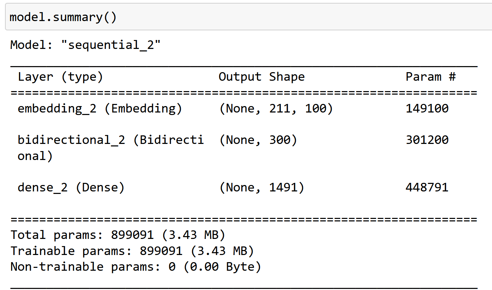

# Text Generation using bidirectional LSTM

This repository contains a deep learning project that generates text based on a provided dataset of short stories using LSTM (Long Short-Term Memory) networks. The model takes keywords as input and generates short stories containing those keywords.

  [](https://pypi.org/project/numpy/) [](https://pypi.org/project/pandas/)  [](https://pypi.org/project/pandas/) [](https://pypi.org/project/pandas/)  




## Project Structure

- `dataset/`: Contains the dataset used for training the model.
- `Short Story Generator.ipynb`: Jupyter Notebook with the complete code for the text generation model.
- `ShortStoryGenerator.pdf`: PDF of final version of jupyter notebook for easy access.
- `README.md`: This file describing the project.

## Dataset:
Dataset for this project is coming from [`TinyStories`](https://www.kaggle.com/datasets/thedevastator/tinystories-narrative-classification) dataset shared in Kaggle. The dataset includes over 2000 annotated stories. 
- Please download dataset from this  [[Link]](https://www.kaggle.com/datasets/thedevastator/tinystories-narrative-classification) and place it in the `dataset\` folder.

- Sample input:
```Once upon a time, in a big lake, there was a brown kayak. The brown kayak liked to roll in the water all day long. It was very happy when it could roll and splash in the lake. One day, a little boy named Tim came to play with the brown kayak. Tim and the brown kayak rolled in the water together. They laughed and had a lot of fun. The sun was shining, and the water was warm. After a while, it was time for Tim to go home. He said goodbye to the brown kayak and gave it a big hug. The brown kayak was sad to see Tim go, but it knew they would play together again soon. So, the brown kayak kept rolling in the water, waiting for the next fun day with Tim.```
## Requirements

- Python 3.x
- Libraries: TensorFlow, Keras, Pandas, NumPy.

## Getting Started

## Clone:

```bash
git clone https://github.com/ali-zeynali/ShortStoryGenerator.git
```

## Report
Report is available from [ShortStoryGenerator.pdf](ShortStoryGenerator.pdf) file.
## Code
The code is written in Jupyter-notebook environment under Python 3.x version. Simpy run command below to open jupyter-notebook:
```bash
python -m notebook
```

## Questions
Feel free to share your comments and thoughts regarding this project or ask me your question via my email address: "a" + __MY LAST NAME__ + "@umass.edu"